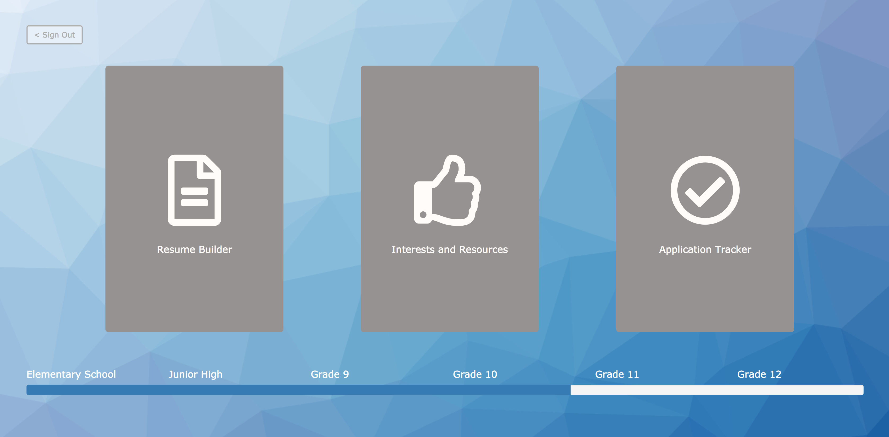

# Track My Path
Kim Kosman, Katie Schermerhorn, Sarah Olson, Sarah Drumm, Connor Higgins, Michael McRoskey

----
## Overview
TRack My Path is a project for the [Robinson Community Learning Center](https://rclc.nd.edu/) which helps students through the college discernment and application process. It runs on a local server via [NodeJS](https://nodejs.org/en/) and utilizes the [JQuery](https://jquery.com/) library.

----
## Files
1. bin/
	* Node packages
2. public/
	* images/
		* **`logo.png`**:
		* **`wallpaper.png`**:
	* stylesheets/
		* **`style.css`**:
3. routes/
	* **`index.js`**: 
4. views/
	* **`apptracker.pug`**: 
	* **`error.pug`**:
	* **`home.pug`**: 
	* **`interests.pug`**: 
	* **`layout.pug`**: 
	* **`login.pug`**: 
	* **`resumebuilder.pug`**: 
	* **`signup.pug`**: 
5. node_modules/
6. images/
	* **`home.png`**: 
7. **`package-lock.json`**:
8. **`package.json`**: 
9. **`README.md`**

----
## Usage
1. Install [NodeJS](https://nodejs.org/en/)
2. Navigate to this directory and run `$ npm start`
3. In a web browser, navigate to `http://localhost:3000/`.
4. Begin tracking your path!

----
## Known Issues

1. 

